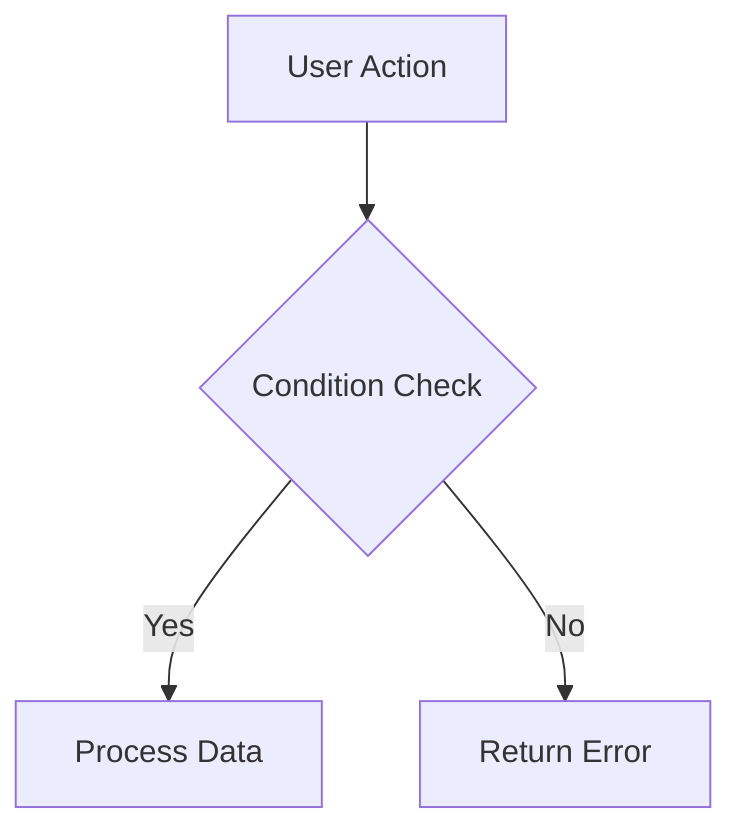

# ✍️ Writing Style & Formatting Rules

> Core Philosophy:
문서는 사람과 AI 에이전트 모두가 **'단 한 번의 읽기(Single Pass)'** 로 명확히 이해할 수 있어야 한다.
모호함(Ambiguity)을 제거하고, 구조(Structure)를 통일한다.
> 

## 1. General Formatting (기본 포맷)

### 1.1. Headers (제목)

- **계층:** `# H1`은 문서 제목에 1회만 사용. 본문은 `## H2` > `### H3` 순서로 사용한다.
- **H4 이하 지양:** 깊이가 너무 깊어지면 `#### H4` 대신 **불렛 포인트**를 사용하여 구조화한다.

### 1.2. Emphasis (강조)

- **Bold (`*text**`):**
    - 핵심 키워드, 결과값, UI 요소 이름 (예: **저장** 버튼).
    - 문장에서 가장 눈에 띄어야 할 단어 1~2개.
- **Inline Code (``text``):**
    - 파일명, 경로, 변수명, 함수명, 단축키.
    - 예: `src/App.tsx` 파일을 열고 `Cmd + S`를 누른다.
- **Italic (`text*`):**
    - 기술 문서에서는 가급적 **사용하지 않는다**. (가독성이 떨어짐)

### 1.3. Links (링크)

- **형식:** `[설명 텍스트](URL)`
- **규칙:** '여기'나 '링크' 같은 모호한 텍스트 금지. 링크의 목적지가 드러나야 함.
    - ❌ `참고 자료: [링크](...)`
    - ✅ `참고 자료: [Google 스타일 가이드](...)`

---

## 2. Structure & Lists (구조와 목록)

### 2.1. Bullet Points (개조식)

- **Data-Oriented Structure:** 문서는 단순한 텍스트가 아닌 **'구조화된 데이터(Structured Data)'**로 취급되어야 한다. 줄글(Paragraph)은 정보 추출이 어려우므로 **불렛 포인트**를 기본으로 사용한다.
- **Conciseness:** 문장은 주어와 설명이 명확한 단문으로 작성하며, 가급적 명사형이나 '~함', '~임'으로 끝내 간결함을 유지한다.
- **Indentation:** 하위 목록은 스페이스 2칸(또는 4칸) 들여쓰기로 계층을 명확히 구분한다.

### 2.2. Numbered Lists (번호 매기기)

- **순서가 중요한 경우**에만 사용한다. (튜토리얼, 우선순위 등)
- 순서가 중요하지 않은 나열은 불렛 포인트를 사용한다.

### 2.3. Checklists (할 일)

- 상태를 명확히 표기한다.
    - `[ ]`: 할 일 (To Do)
    - `[x]`: 완료 (Done)
    - `[-]`: 취소됨 (Canceled/Dropped) - *삭제하지 말고 취소 표시를 남겨 이력을 보존한다.*

---

## 3. Data Standardization (데이터 표기 표준)

### 3.1. Dates & Time (날짜와 시간)

- **날짜:** `YYYY-MM-DD` (ISO 8601 표준)
    - ✅ `2024-01-14`
- **시간:** `HH:mm` (24시간제)
    - ✅ `14:30` (오후 2시 30분)
- **기간:** 물결표(`~`) 사용.
    - ✅ `2024-01-14 ~ 2024-01-20`

### 3.2. Images & Media (이미지)

- **형식:** ``
- **Alt Text 필수:** 이미지가 깨지거나 AI가 텍스트만 읽을 때를 대비해, 이미지 내용을 설명하는 텍스트를 반드시 넣는다.
    - ❌ ``
    - ✅ ``

---

## 4. Special Blocks (특수 블록)

### 4.1. Callouts / Blockquotes (인용문)

문서의 흐름과 별도로 강조해야 할 내용에 사용한다.

- `> **Note:**` : 참고 사항, 부연 설명.
- `> **Warning:**` : 주의 사항, 치명적인 실수 방지.
- `> **Tip:**` : 꿀팁, 생산성 향상 방법.

### 4.2. Code Blocks (코드 블록)

- 반드시 **언어(Language)**를 명시하여 문법 강조(Syntax Highlighting)를 활성화한다.
- 파일명이 필요한 경우 주석으로 첫 줄에 명시한다.

```markdown
    ```typescript
    // src/utils/date.ts
    export const formatDate = (date: Date) => { ... }
    ```
```

### 4.3. Mermaid Diagrams (다이어그램)

- **Type Specification:** 반드시 명확한 다이어그램 타입(`graph TD`, `sequenceDiagram` 등)으로 시작한다.
- **Label Quoting:** 텍스트에 공백이나 특수기호(`()`, `[]`, `{}`)가 포함될 경우 반드시 **쌍따옴표**(`" "`)로 감싸 파싱 에러를 방지한다.
    - ❌ `A[Log in (User)] --> B{Valid?}`
    - ✅ `A["Log in (User)"] --> B{"Valid?"}`
- **Simplicity:** 복잡한 스타일링(`style`, `classDef`)이나 실험적인 문법은 지양하고 데이터 흐름 표현에 집중한다.



## 5. Tone & Context (어조와 문맥)

### 5.1. Explicit Referencing (명시적 지칭)

- **대명사 사용 금지:** AI는 '그것(It)', '저것(That)', '이전 파일'을 헷갈려 할 수 있다.
    - ❌ "그 파일을 수정해서 저기로 옮겨."
    - ✅ "`auth.controller.ts`를 수정해서 `src/features/auth/api/`로 이동시켜."

### 5.2. Dry & Fact-based (건조하고 사실적으로)

- 감정을 배제하고 동작과 결과 위주로 서술한다.
- 문장은 **완결된 형태**여야 한다. (주어 + 서술어 명확하게)
