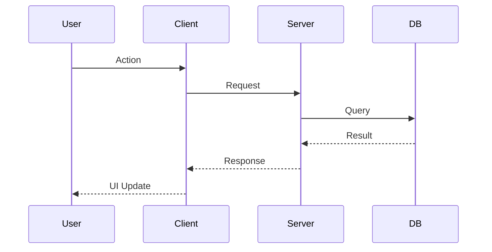

# [${Type}-${Domain}-${ID}] ${SLICE_DESCRIPTION}

> **Title Convention:**
> - **Type:** Conventional Commits 카테고리 기반. 첫 글자 대문자 사용. 예: `Feat`, `Fix`, `Refactor`, `Docs`, `Style`, `Test`, `Chore`, `Config`
> - **Domain:** Slice가 포함되는 범위. Feature name 포함. 예: `Auth`, `Editor`, `Documents`
> - **ID:** Slice 고유 ID
> - **Slice Description:** 한국어로 작성함
>
> **Example:** `[Feat-Auth-1] 회원가입 기능 추가`

> **Assignee:** @Agent / @User
>
> **Status:** 📝 Planning / 🚧 In Progress / ✅ Done
>
> **Linked Issue:** #TBD (Issue 생성 후 업데이트)
>
> **Date:** 202X-XX-XX

## 1. 🧠 Planning (기획 및 명세)

### 1.1. Context & Value (배경 및 가치)
> *Why are we building this? What user value does it provide?*
> 이 기능이 왜 필요한지, 사용자가 얻는 가치는 무엇인지 정의합니다.

- **Problem:** (해결하려는 문제)
- **Solution:** (제안하는 솔루션)
- **Value:** (기대 효과)

### 1.2. Scope & Boundaries (수직적 범위)
> *Define the critical path across all layers.*
> 각 계층에서 구현해야 할 최소한의 범위를 정의합니다.

- **Presentation (UI):** (e.g., 로그인 폼 컴포넌트, 에러 메시지 표시)
- **Application (API):** (e.g., `POST /api/auth/login` 엔드포인트)
- **Domain (Biz Logic):** (e.g., 이메일 형식 검증, 비밀번호 해싱 비교)
- **Persistence (DB):** (e.g., `users` 테이블 조회)

### 1.3. User Flow (Mermaid)
> *Visualize the interaction flow.*
> 사용자의 행동에 따른 데이터 흐름을 시각화합니다.

### 1.4. Requirements Sanity Checklist (요구사항 체크리스트)

> *Construction-time sanity check (Code Complete Inspired).*
> 구현 전에 요구사항의 품질/완전성을 점검합니다.

- [ ] **Inputs 정의:** 입력 소스, 정확도/범위, 빈도 정의됨.
- [ ] **Outputs 정의:** 출력 대상, 정확도/범위, 빈도, 포맷 정의됨.
- [ ] **User Tasks 정의:** 사용자가 수행하는 작업 단위가 모두 정의됨.
- [ ] **Data 정의:** 각 작업에 사용되는 데이터와 결과 데이터가 정의됨.
- [ ] **Success/Failure 정의:** 성공 조건과 실패 조건이 명확히 정의됨.
- [ ] **Security 정의:** 인증/인가 수준, 보호 대상 데이터 정의됨.
- [ ] **Performance 정의:** 사용자 관점 응답시간 또는 주요 타이밍 요구사항 정의됨.
- [ ] **Reliability 정의:** 장애 시 영향, 에러 탐지/복구 전략 정의됨.
- [ ] **Trade-off 정의:** 경쟁하는 품질 속성 간 트레이드오프 합의됨.
- [ ] **No Design Lock-in:** 요구사항이 설계를 과도하게 강제하지 않음.
- [ ] **Testability:** 독립된 테스트로 충족 여부 판단 가능함.
- [ ] **Unknowns 기록:** 사전 정보 부족 영역과 추후 결정 항목이 명시됨.

## 2. ✅ Acceptance Criteria (AC, 인수 조건 - QC 기준)
> *Specific, Testable conditions. This serves as the QC checklist.*
> 기능 완료를 판단할 수 있는 구체적인 테스트 시나리오입니다.

> **Rule:** 각 항목은 고유 ID를 부여하고(예: `AC-01`), 구현 단계에서 테스트 케이스로 추적 가능해야 합니다.

- [ ] **Success Case:**
    - [ ] (AC-01) (입력 조건) -> (기대 결과)
- [ ] **Failure Case:**
    - [ ] (AC-02) (입력 조건) -> (적절한 에러 메시지 노출)
- [ ] **Edge Case:**
    - [ ] (AC-03) (특이 조건) -> (시스템 안정성 유지)

### 2.1. Test Plan (AC → Tests)

> **Goal:** AC가 실제 테스트로 구현되었는지 추적 가능하게 유지합니다.

| AC ID | Test Type (unit/integration/e2e) | Test Location | Notes |
| --- | --- | --- | --- |
| AC-01 |  |  |  |
| AC-02 |  |  |  |
| AC-03 |  |  |  |

## 3. 🏗 Implementation (구현 및 검증 계획)

### 3.1. Data Model Changes (If any)
- [ ] 테이블 생성/수정: `table_name`
- [ ] RLS 정책 적용

### 3.2. API Specifications
- `METHOD /path` - (간략 설명)

### 3.3. Task Breakdown (Step-by-Step Execution)
> **Agent Protocol:**
> 1. 체크리스트를 기반으로 작업을 명확한 단위로 인지한다.
> 2. 각 작업은 **Test Code (or Spec) -> Implementation -> Verification** 순서로 진행한다.
> 3. 각 Layer(Step)가 완료될 때마다 커밋을 남긴다.

> **Traceability:** 각 Step은 어떤 AC를 커버하는지 명시한다. (예: `Covers: AC-01, AC-02`)

#### Step 1: Persistence (DB)
- Covers: (e.g., AC-01)
- [ ] **Migration File:** `supabase/migrations` SQL 작성
- [ ] **Apply & Type Gen:** 마이그레이션 적용 및 `database.types.ts` 업데이트
- [ ] **Verification:** Table/RLS가 의도대로 설정되었는지 확인

#### Step 2: Domain (Business Logic)
- Covers: (e.g., AC-01, AC-03)
- [ ] **Unit Test:** 비즈니스 규칙을 검증하는 테스트 케이스 작성 (`.spec.ts`)
- [ ] **Implementation:** 테스트를 통과하는 순수 함수/클래스 구현
- [ ] **Refactoring:** 가독성 및 효율성 개선

#### Step 3: Application (API Interface)
- Covers: (e.g., AC-02)
- [ ] **Route Handler:** API 엔드포인트 스켈레톤 작성
- [ ] **Integration Test:** 요청/응답 시나리오 테스트 작성
- [ ] **Logic Integration:** 도메인 로직 연결 및 에러 처리 구현

#### Step 4: Presentation (UI Components)
- Covers: (e.g., AC-01, AC-02)
- [ ] **Component Structure:** UI 컴포넌트 마크업
- [ ] **Data Binding:** API 클라이언트(`query/mutation`) 연동
- [ ] **Interaction:** 사용자 입력 및 이벤트 핸들링 구현
- [ ] **UX/UI Review:** 로딩/에러 상태 및 스타일링 점검

#### Step 5: Final Review
- [ ] **All Tests Pass:** 전체 테스트 슈트 실행
- [ ] **Code Cleanup:** 주석, 미사용 코드 정리

## 4. 🏁 DoD Verification (Definition of Done)
> *Final check before merging. All must be checked.*
> 작업 완료 선언 전 필수 점검 사항입니다.

- [ ] **End-to-End Execution:** UI에서 DB까지 데이터 흐름이 끊김 없이 동작함.
- [ ] **Test Coverage:** 해당 기능에 대한 단위(Unit) 및 통합(Integration) 테스트가 통과됨.
- [ ] **Code Quality:** 린트(Lint) 및 포맷팅 규칙 준수 (No Errors).
- [ ] **Self-Review:** 불필요한 로그(Console.log) 및 주석 제거 완료.
