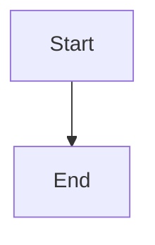

# [YYMMDD] Slice-N: [기능명]

> **작성자**: [이름]  
> **상태**: ⬜ Planning | 🟦 In Progress | ✅ Done  
> **예상 완료일**: 202X-XX-XX

## 1. 컨텍스트 및 목표 (Context & Goal)

> 왜 이 작업을 하는지, 이전 Slice와 어떻게 연결되는지 설명합니다.

- **목표 (Goal)**: 달성하고자 하는 비즈니스/사용자 가치를 한 문장으로 정의.
- **범위 (Scope)**: 포함되는 기능과 포함되지 않는 기능(Out of Scope).
- **선행 의존성 (Pre-requisites)**: 선행되어야 할 Slice 또는 필수 구현 사항.

## 2. 요구사항 명세 (Specifications - SOT)

> **이 섹션은 구현 후 `docs/00_specs`로 이관될 잠재적인 Spec입니다.**

### 2.1. 사용자 흐름 (User Flow)

### 2.2. 상세 기능 및 인수 조건 (Acceptance Criteria)

- **기능 A**:
  - [ ] 동작 상세 설명 1
  - [ ] 엣지 케이스 처리

### 2.3. 비기능 요구사항 (Non-Functional Requirements)

- **성능/UX**: 예) 응답 속도, 애니메이션 등.

## 3. 구현 단계 (Implementation Steps)

> 에이전트가 수행할 작업 단위를 구체적인 '기술 서사(Technical Narrative)'와 함께 정의합니다.

### Step 1: [단계 명]

**목표 (Goal)**: 무엇을 왜 만드는지 한 문장으로 정의.

**설명 (Description)**: 
어떻게 구현할 것인지 기술적인 문장으로 상세 기술. (어떤 라이브러리를 쓰고, 데이터 흐름은 어떠하며, 파일 간의 관계는 어떤지 등)

**작업 (Checklist)**:
- [ ] 작업 내용 1
- [ ] 작업 내용 2

**검증 (Verification)**:
- [ ] 이 단계가 완료되었음을 확인하는 테스트 방법 (실행, 로그 확인 등)

### Step 2: [단계 명]

**목표 (Goal)**: 

**설명 (Description)**:

**작업 (Checklist)**:
- [ ] 

**검증 (Verification)**:
- [ ] 

## 4. 회고 (Retrospective)
<!-- 작업 완료 후 작성 -->
