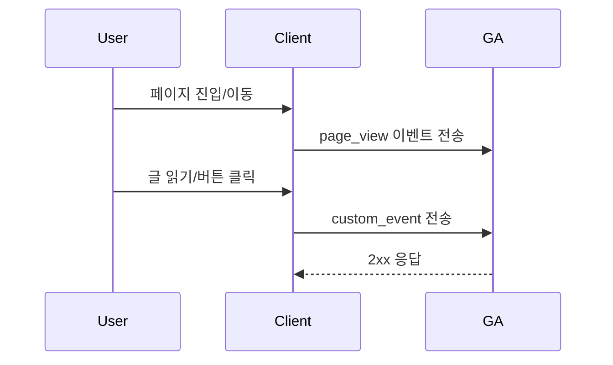

# [Feat-Analytics-07] GA 설치 및 사용자 행동 수집

> **Assignee:** @Agent / @User
>
> **Status:** ✅ Done
>
> **Linked Issue:** #167
>
> **Date:** 2026-01-18

## 1. 🧠 Planning (기획 및 명세)

### 1.1. Context & Value (배경 및 가치)

- **Problem:** 방문자 행동 데이터가 수집되지 않아 콘텐츠 성과와 유입 흐름을 판단하기 어려움.
- **Solution:** GA4 스크립트 설치와 핵심 이벤트 정의로 페이지뷰 및 주요 행동을 수집함.
- **Value:** 콘텐츠 개선과 트래픽 분석 의사결정이 가능해짐.

### 1.2. Scope & Boundaries (수직적 범위)

- **Presentation (UI):** `app/layout.tsx`에 GA 스크립트 주입, 라우트 변경 시 페이지뷰 전송, 주요 행동 이벤트 호출.
- **Application (API):** 클라이언트 전용 트래킹 유틸 API(`trackPageView`, `trackEvent`) 제공.
- **Domain (Biz Logic):** 이벤트 이름/속성 규칙과 스키마 정의, 허용 이벤트 목록 관리.
- **Persistence (DB):** Google Analytics 수집 엔드포인트(`https://www.google-analytics.com/g/collect`)로 전송.

### 1.3. GA4 설치 구성 (상세)

- **Measurement ID:** 환경 변수 `NEXT_PUBLIC_GA_ID`로 주입함.
- **스크립트 로딩:** `next/script`로 비동기 로딩, 초기 `page_view` 자동 전송은 비활성화함.
- **전송 방식:** `gtag` 기반 이벤트 전송, 라우트 변경 시 수동으로 `page_view` 전송함.
- **데이터 정책:** 개인 식별 가능 정보(PII) 전송 금지, 텍스트 필드 길이 제한 적용.

### 1.4. 수집 데이터 및 활용 계획

- **핵심 수집 데이터:**
  - **페이지뷰:** `page_view` (경로, 제목, URL, 리퍼러).
  - **콘텐츠 조회:** `article_view` (글 ID, 제목, 시리즈명, 태그, 작성자).
  - **상호작용:** `scroll`, `click`, `outbound_click`, `file_download`.
  - **세션 지표:** `session_start`, `user_engagement`.
- **활용 목적:**
  - **콘텐츠 개선:** 조회수, 체류 시간, 스크롤 깊이 기반 인기글/개선 포인트 도출.
  - **유입 분석:** 유입 채널, 리퍼러, 캠페인 성과 확인.
  - **전환 가설 검증:** 클릭 이벤트 기반 CTA 효과 측정.
  - **운영 판단:** 글/시리즈별 트래픽 추이와 트렌드 파악.
- **주요 리포트 지표:**
  - **Engagement Rate**, **Average Engagement Time**, **Views per Session**.
  - **Top Pages**, **Traffic Sources**, **Event Count**.

### 1.5. User Flow (Mermaid)

### 1.6. Requirements Sanity Checklist (요구사항 체크리스트)

#### 2.1. Functional Requirements (기능 요구사항)

- [x] **Inputs:** GA 측정 ID(`NEXT_PUBLIC_GA_ID`)와 이벤트 속성 입력 범위 정의됨.
- [x] **Outputs:** GA 이벤트 전송 대상과 포맷 정의됨.
- [x] **User Tasks:** 방문/이동/글 조회/버튼 클릭이 모두 나열됨.
- [x] **Data Flow:** 이벤트가 클라이언트에서 GA로 전달되는 흐름이 정의됨.
- [x] **External Interfaces:** Google Analytics 수집 엔드포인트 의존성이 명시됨.

#### 2.2. Nonfunctional Requirements (품질 요구사항)

- [x] **Performance:** 페이지 렌더링에 영향을 최소화하도록 비동기 스크립트 로딩.
- [x] **Security:** 공개 키만 사용하며 민감 정보는 전송하지 않음.
- [x] **Reliability:** `NEXT_PUBLIC_GA_ID`가 없으면 트래킹을 비활성화함.
- [x] **Maintainability:** 이벤트 이름/속성은 중앙 정의로 관리함.

#### 2.3. Requirements Quality (요구사항 품질)

- [x] **User Language:** 사용자 관점으로 행동 시나리오가 서술됨.
- [x] **No Conflicts:** 기존 로그/분석 시스템과 충돌 없음.
- [x] **No Design Lock-in:** 구현 방식 변경 가능함.
- [x] **Consistent Detail:** 요구사항 디테일 수준이 일관됨.
- [x] **Traceability:** 문제 및 목표가 추적 가능함.
- [x] **Testability:** 이벤트 호출 여부를 테스트로 검증 가능함.

#### 2.4. Requirements Completeness (요구사항 완전성)

- [x] **Unknowns:** 이벤트 목록 확정 및 측정 ID 확정 필요.
- [x] **Definition of Success/Failure:** 이벤트 전송 성공/실패 기준 정의됨.
- [x] **Feasibility:** Next.js 환경에서 GA 적용 가능함.

## 2. ✅ Acceptance Criteria (AC, 인수 조건 - QC 기준)

- [x] **Success Case:**
  - [x] (AC-01) 유효한 `NEXT_PUBLIC_GA_ID`가 있을 때 모든 페이지 이동에 대해 `page_view`가 전송됨.
  - [x] (AC-02) 글 상세 페이지 진입 시 `article_view` 이벤트가 전송됨.
- [x] **Failure Case:**
  - [x] (AC-03) `NEXT_PUBLIC_GA_ID`가 없으면 이벤트 전송이 발생하지 않음.
- [x] **Edge Case:**
  - [x] (AC-04) 이벤트 전송 실패가 UI 오류로 전파되지 않음.

### 2.1. Test Plan (AC → Tests)

| AC ID | Test Type (unit/integration/e2e) | Test Location                          | Notes                         |
| ----- | -------------------------------- | -------------------------------------- | ----------------------------- |
| AC-01 | integration                      | `src/shared/lib/analytics`             | 라우트 변경 시 호출 여부 검증 |
| AC-02 | integration                      | `src/app/article/[articleId]/page.tsx` | 글 상세 진입 이벤트 검증      |
| AC-03 | unit                             | `src/shared/lib/analytics`             | 측정 ID 부재 시 no-op 검증    |
| AC-04 | unit                             | `src/shared/lib/analytics`             | 실패 시 예외 미전파 확인      |

## 3. 🏗 Implementation (구현 및 검증 계획)

### 3.1. Data Model Changes (If any)

- [x] 테이블 생성/수정 없음
- [x] RLS 정책 적용 없음

### 3.2. API Specifications

- `trackPageView(pathname: string)` - 페이지뷰 전송
- `trackEvent(name: string, params: Record<string, unknown>)` - 커스텀 이벤트 전송

### 3.3. Task Breakdown (Step-by-Step Execution)

#### Step 1: Persistence (DB)

- Covers: AC-01, AC-02, AC-03, AC-04
- [x] **Verification:** GA 수집 엔드포인트 전송 확인

#### Step 2: Domain (Business Logic)

- Covers: AC-01, AC-02, AC-03
- [x] **Unit Test:** 이벤트 이름/속성 규칙 테스트 작성
- [x] **Implementation:** 이벤트 정의 및 스키마 작성
- [x] **Refactoring:** 이벤트 목록 정리

#### Step 3: Application (API Interface)

- Covers: AC-01, AC-03, AC-04
- [x] **Integration Test:** `trackPageView`, `trackEvent` 호출 시나리오 테스트
- [x] **Logic Integration:** 측정 ID 유무 처리 및 예외 방지

#### Step 4: Presentation (UI Components)

- Covers: AC-01, AC-02
- [x] **Component Structure:** `app/layout.tsx`에 스크립트 로딩 삽입
- [x] **Interaction:** 라우트 변경 및 글 상세 진입 시 이벤트 호출
- [x] **UX/UI Review:** 렌더링 지연 및 콘솔 오류 없음

#### Step 5: Final Review

- [x] **All Tests Pass:** 전체 테스트 슈트 실행
- [x] **Code Cleanup:** 불필요한 로깅 제거

## 4. 🏁 DoD Verification (Definition of Done)

- [x] **End-to-End Execution:** 페이지 진입부터 GA 이벤트 전송까지 동작함.
- [x] **Test Coverage:** 관련 테스트가 통과됨.
- [x] **Code Quality:** 린트 및 포맷 규칙 준수.
- [x] **Self-Review:** 콘솔 로그 및 임시 코드 제거.
